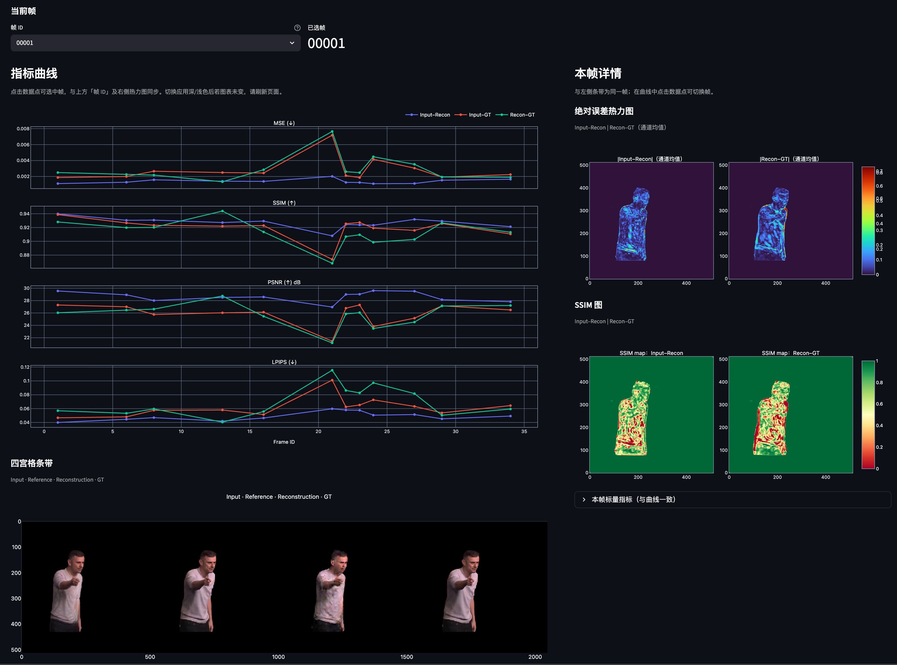

# 推理结果可视化（viz-tools）

用于浏览模型推理输出的**四宫格合成图**（Input · Reference · Reconstruction · GT），并交互查看**逐帧指标曲线**、**误差热力图 / SSIM 图**与**四宫格条带预览**。基于 [Streamlit](https://streamlit.io) + Plotly，本地运行即可。

## 界面预览



## 功能概要

- **数据源**：填写结果目录路径，或批量上传帧图（文件名需为数字帧号，如 `00001.png`）。
- **指标曲线**：全序列 MSE / SSIM / PSNR / LPIPS（三对：Input–Recon、Input–GT、Recon–GT）；点击曲线数据点可切换当前帧。
- **本帧**：绝对误差热力图与 SSIM 图（上下排列）、四宫格条带；展开可查看标量指标。
- **主题**：随 Streamlit 应用明暗主题切换图表样式（若切换后未立即生效，可刷新页面）。

## 数据约定

每张合成图从左到右 **4 等分**为：input、reference、reconstruction、ground truth。文件名表示视频帧 ID（如 `00001.png`）。

## 运行方式

```bash
cd viz-tools
python3 -m venv .venv
source .venv/bin/activate   # Windows: .venv\Scripts\activate
pip install -r requirements.txt
streamlit run app.py
# 或: python main.py
```

首次启用 LPIPS 时会下载预训练权重；不需要 LPIPS 时可在侧栏关闭以加快计算。

## 目录说明

| 路径 | 说明 |
|------|------|
| `app.py` | Streamlit 入口 |
| `main.py` | 等价于 `streamlit run app.py` |
| `viztools/` | 图像切分、指标、Plotly 图与主题 |

LPIPS 使用 PyPI 包 [`lpips`](https://github.com/richzhang/PerceptualSimilarity)（与 [perceptualsimilarity](https://github.com/richzhang/perceptualsimilarity) 一致）。
